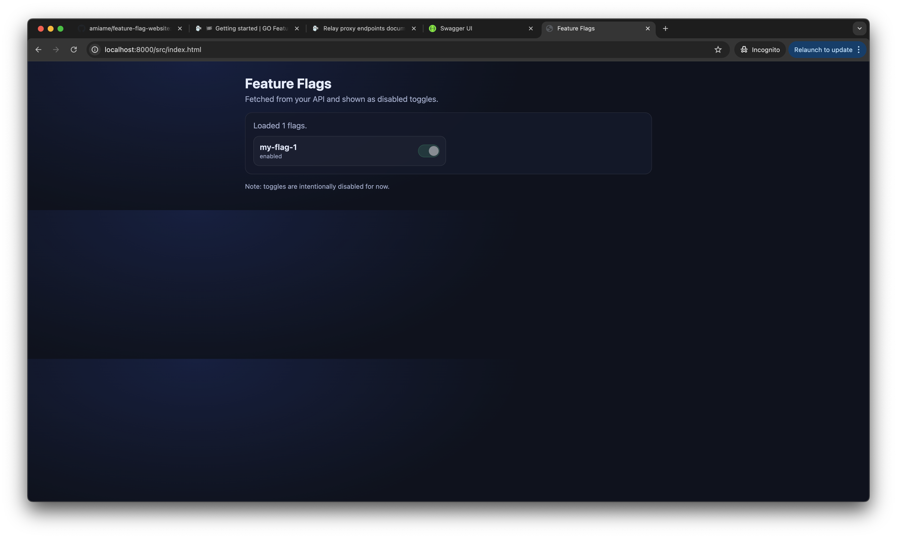

- [x] Where to store the feature flag?
- [x] Set up relay proxy
- [x] Set up a page to show the feature flag status for dev
- [ ] Set up a button to toggle the feature flag
- [ ] Set up another page to show the feature flag status for staging 
- [ ] Set up tabs to switch between dev and staging feature flag status
- [ ] Set up a button to toggle the feature flag for staging
- [ ] Set up another page to show the feature flag status for production
- [ ] Set up a button to toggle the feature flag for production
- [ ] Set up tabs to switch between dev, staging, and production feature flag status
- [ ] Set up authentication for accessing website
- [ ] Set up authorization for toggling feature flags in dev, staging, and production

# Where to store the feature flag?
- Let's start small. We'll use a file. When we scale, we can move to a postgres database because we already use it for other things. 

# Set up relay proxy
- Done. Just followed the instructions in https://gofeatureflag.org/docs/relay-proxy/getting_started.

# Set up a page to show the feature flag status for dev
- Done. The website shows the feature flag status for dev environment.
- Screenshot:

# Set up a button to toggle the feature flag
- Turns out, if I store the feature flag in a file, I cannot toggle it via the relay proxy API. So I need to store the feature flag in a database. Moving on to the next task.
